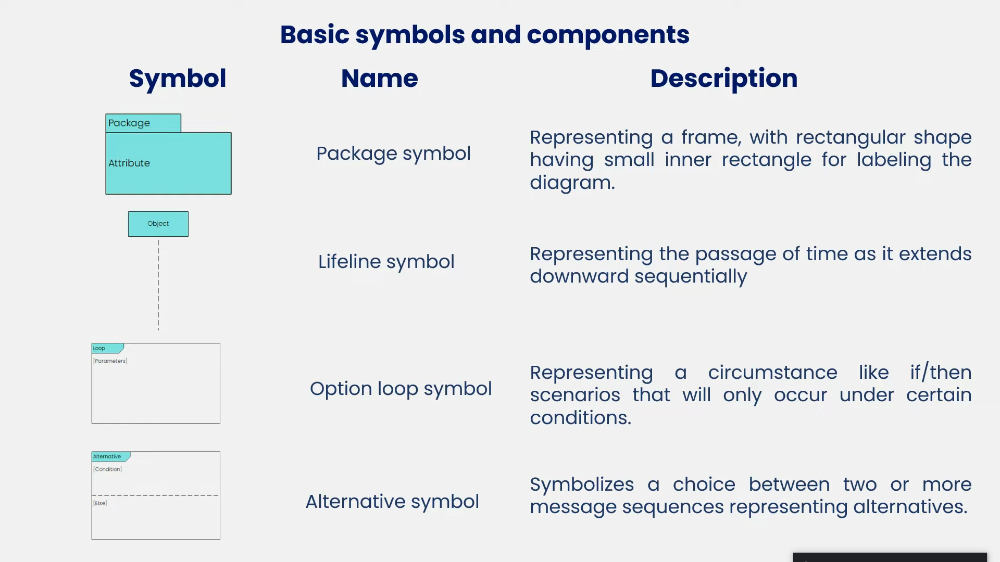
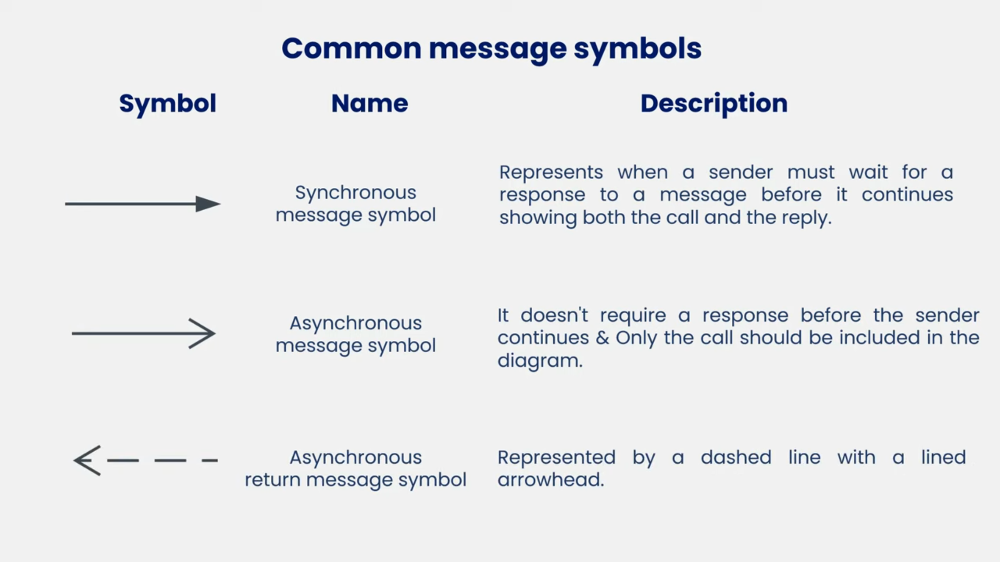
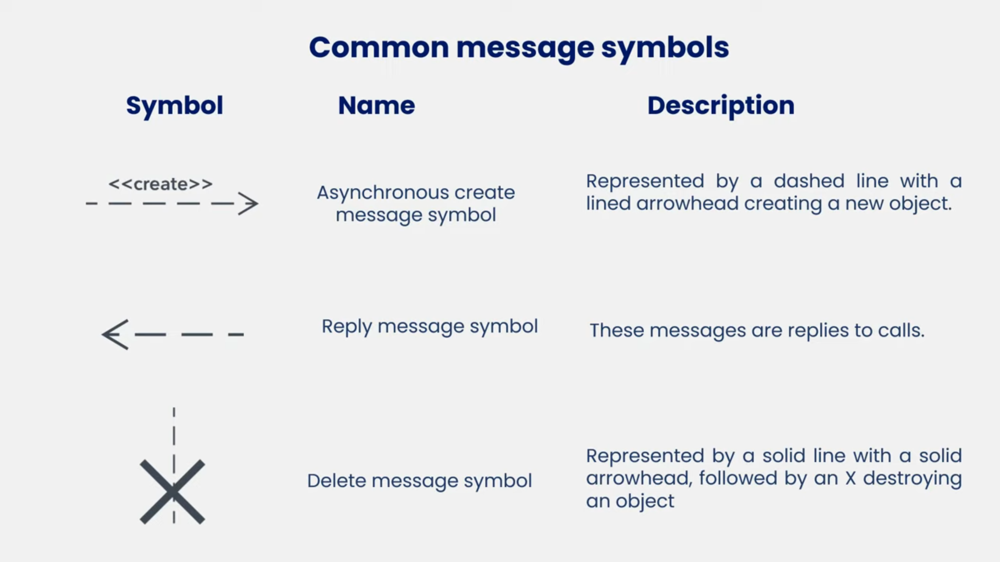
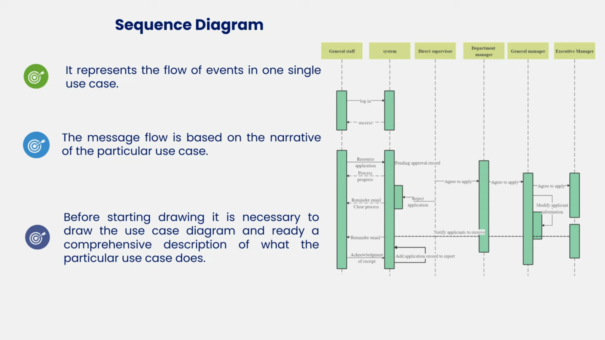

===============================2026/1/20=============================================
# uml sequence diagram

## object symbol:
It represents a class or object in uml demonstrating how it will behave in the system.

## Activation box:
Represents the time needed for an object to complete a task.
	
Represents the time needed for an object to complete a task. The longer the task will take, the longer the activation box becomes.

## Actor symbol:
represents entities that interacts with or are external to the system.

