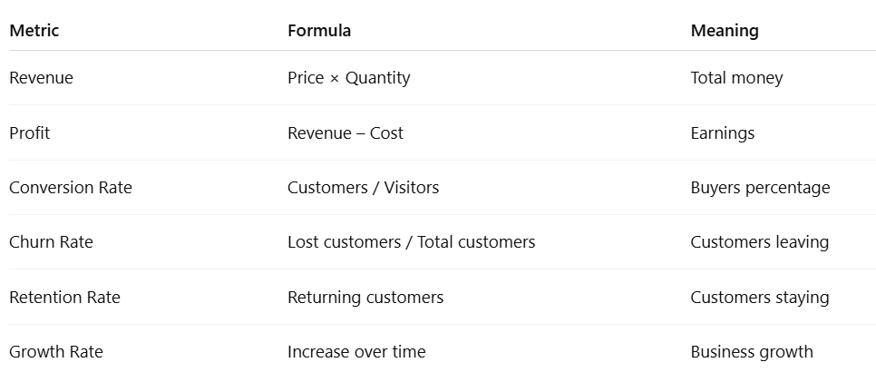

===================================2026/4/1================================================
### learned to generate app password:

1. Google Account → Security
2. 2-Step Verification ON
3. App Password → Mail → Generate → Paste password

===================================2026/4/2================================================
### public speaking
Breathe
Just a small thing to remember – breathe! I see so many people speaking whilst literally holding their breath. Deep belly breathing before you go on will get you centred. And breathing properly throughout will help you keep your pace, let your audience catch up with you, and help you collect your thoughts if you happen to momentarily lose them.

===================================2026/4/3================================================
# Project 4(q.no.2) freecodecamp: Clean the data by filtering out days when the page views were in the top 2.5% of the dataset or bottom 2.5% of the dataset.

## **Concept**

Imagine  data sorted from smallest → largest:

Small values ---- normal values ---- very large values
     2.5%              95%               2.5%
   remove            keep              remove

So we keep only the middle 95% of data.

This is done using percentiles.

Percentile Meaning
- 2.5 percentile → value below which 2.5% data lies
- 97.5 percentile → value below which 97.5% data lies

So we:

lower_limit = 2.5 percentile
upper_limit = 97.5 percentile

*Keep rows where:*
*value >= lower_limit AND value <= upper_limit*

## *This is called outlier removal.*

We want the actual value at that percentile.
lower_limit = percentile value
upper_limit = percentile value

### leanring from Mistake : Filtering Syntax Wrong

I wrote:

**df_cleaned = df['value'] >= lower_limit & df['value'] <= upper_limit**

This has two problems:

- we must use parentheses around each condition.
- This currently gives True/False, not filtered dataframe.

## Correct concept:
## df_cleaned = df[ condition1 AND condition2 ]

===================================2026/4/4================================================
# Basic of Data Analysis

### WHERE vs HAVING — this is asked in nearly every SQL exam:

1. WHERE filters rows before grouping — it works on individual rows
2. HAVING filters after grouping — it works on the result of aggregate functions

**Simple rule: if we're filtering on COUNT(), SUM(), or AVG(), we need HAVING, not WHERE**

INNER JOIN vs LEFT JOIN — know the difference in one sentence each:

- INNER JOIN — only rows that exist in both tables. 
- LEFT JOIN — all rows from the left table, matched data from the right. 

===================================2026/4/5================================================
 today i learned something from my experience, always be prepared ,preparation gives better oppurtunities

===================================2026/4/8================================================
# Brainstorming

What will you use for x-axis? (df_cleaned.index or column?)
ans:for x axis i will use df_cleaned.index because we are visualizing continous data over time(time series) where date in independent variable

- It’s a DatetimeIndex
- Time series always uses time on x-axis

What will you use for y-axis?
ans: for y axis i will use df_cleaned.column because as it is dependent variable like number or count page views is specified for specific date

Why do we use fig = plt.figure() and return fig?
ans:we use fig = plt.figure() and return fig to return the ploted figure to visualize.

- freeCodeCamp tests check the returned figure
- It allows external files (like main.py) to use it
*return fig → required for testing and reuse*
Why should we use a copy of dataframe inside the function?
ans:we should use a copy of dataframe inside the function inorder to

- Prevent accidental modification
- Keep original dataset safe
- Important in multi-function projects

**Correct approach to define df_cleaned  inside function or global**
df_cleaned should be created once globally (outside functions)
Inside each function → use a copy of it

👉 Why?
All 3 plots must use the same cleaned dataset
Avoid recomputing again and again
Matches how the test file expects structure

- global cleaned df → used by all functions
- inside function → df_cleaned.copy()

===================================2026/4/9================================================
A greedy algorithm is a type of algorithm that follows the problem-solving heuristic of making the locally optimal choice at each stage with the hope of finding a global optimum. While it may not find the global optimum, greedy algorithms are often simpler and faster while being not too far from the global optimum.

===================================2026/4/11================================================
# Concept of two log in 
Browser tabs are NOT independent for authentication

They share:
localStorage
cookies
So only one logged-in user per browser session
Browsers use shared storage like localStorage for authentication tokens. When a second user logs in, it overrides the existing token. So both tabs reflect the latest logged-in user. To test multiple users, we use different browsers or incognito sessions.

===================================2026/4/14================================================

import pandas as pd
sr = pd.Series(['2012-10-21 09:30', '2019-7-18 12:30', '2008-02-2 10:30',
                '2010-4-22 09:25', '2019-11-8 02:22'])

idx = ['Day 1', 'Day 2', 'Day 3', 'Day 4', 'Day 5']
sr.index = idx
sr = pd.to_datetime(sr)
result = sr.dt.year
print(result)

===================================2026/4/16================================================

# Box plot

A Box Plot is also known as a Box and Whisker Plot and it is a graphical tool used to understand the distribution of numerical data. It shows the median, quartiles and possible outliers in a simple visual form.

# strftime 
strftime stands for "string format time" — it converts a datetime into a string using format codes.

### implementation in project
df_copy['month'] = df_copy.index.strftime('%b')

===================================2026/4/18================================================
### project 5(sea level rise):👉 Why is recent data (after 2000) more important for prediction?

Recent data (after 2000) is more important because it reflects the current rate of sea level rise, which may be accelerating due to climate change. Using only recent data helps produce a **more realistic prediction** for the future compared to using older data where the trend might have been slower.

