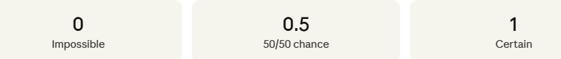
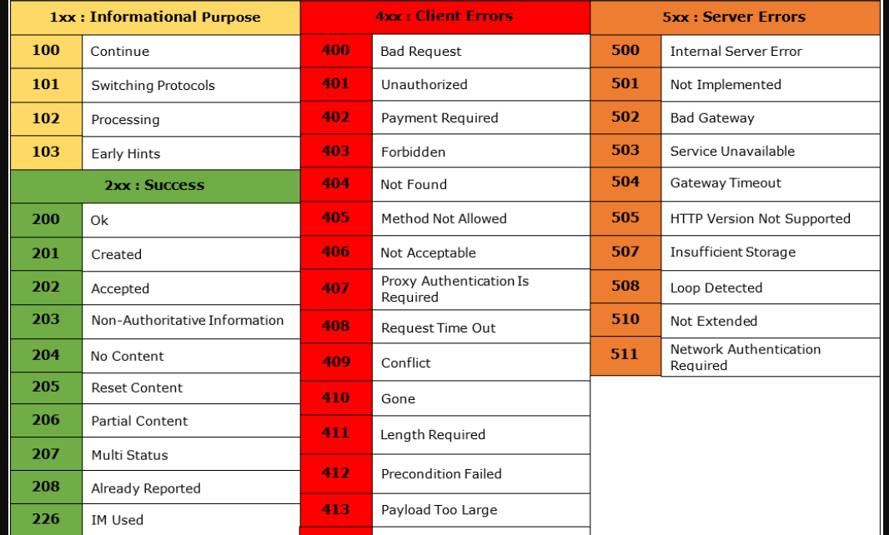
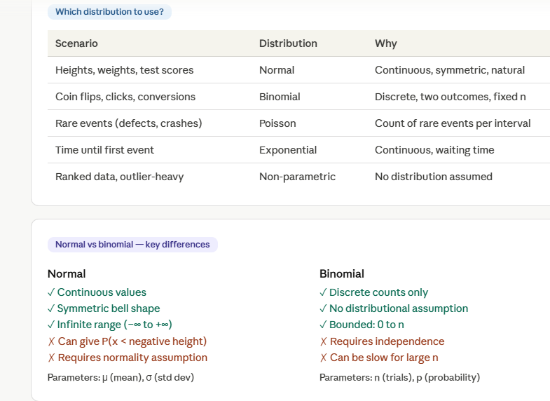

# project 5 from free code camp (sea-level-predictor)
Columns Meaning (Correct + Clear)
*Year*
The year when measurement was taken.
Acts as your time axis (X-axis).
*CSIRO Adjusted Sea Level*
This is the main value to use.
It represents global mean sea level change (in inches).
Adjusted using data from CSIRO (Commonwealth Scientific and Industrial Research Organisation).
*Lower Error Bound*
*Upper Error Bound*
These are uncertainty ranges, not “invalid/error values”.

**Think:**
“Actual sea level is likely between these two values.”
Used in scientific analysis to show confidence.

*NOAA Adjusted Sea Level*
Another dataset from a different organization (NOAA).
Similar purpose but calculated differently.
❗  NOT using this in this project.

👉 Why are we NOT using:

Lower Error Bound
Upper Error Bound
NOAA data

You should be able to say:

“Because the task specifically requires CSIRO data and we are focusing on a single consistent dataset for regression.”

**Why scatter plot first instead of directly plotting a line?**
“A scatter plot is used first because it shows the raw relationship between year and sea level without imposing any assumptions. Each point represents an actual observation, allowing us to detect trends, patterns, or outliers. If we directly plot a line, we assume a relationship without first verifying whether the data supports it.”

# ============================ APA format =============================================

# 📘 What is APA Format?

**APA (American Psychological Association) format** is a standard style used to write research papers, especially in subjects like psychology, education, business, and social sciences.

👉 Think of it as a **rulebook for presenting your ideas clearly and professionally**.

---

# 🧠 Why APA is Important

* It makes your paper **organized and easy to read**
* It gives **credit to original authors** (avoids plagiarism)
* It shows your work is **academic and trustworthy**
* It keeps formatting **consistent across research papers**

---

# 📄 1. General Formatting Rules

These are the basics you must always follow:

* Use **12-point font** (usually Times New Roman)
* Double-space everything (no single spacing anywhere)
* 1-inch margins on all sides
* Align text to the left (not justified)
* Add page numbers in the top right corner
* Indent the first line of each paragraph (0.5 inch)

---

# 🧾 2. Structure of an APA Research Paper

Your paper usually follows this order:

### 1. Title Page

* Paper title (centered, bold)
* Your name
* Institution name
* Course name
* Instructor name
* Date

👉 Keep it clean and centered

---

### 2. Abstract (Optional sometimes)

* A short summary (150–250 words)
* Covers:

  * What your research is about
  * Method used
  * Key results

👉 Write this **last**, even though it comes first

---

### 3. Main Body

This is your actual research:

#### Introduction

* Explain your topic
* State your research question or objective
* Give background info

#### Method (if needed)

* How you collected data
* Tools, surveys, experiments

#### Results

* What you found (facts, no opinions)

#### Discussion

* Explain what the results mean
* Connect back to your question

---

### 4. References Page

* List all sources you used
* Must follow strict APA format

---

# 🔗 3. In-Text Citation (VERY IMPORTANT)

Whenever you use someone else’s idea, you must cite it.

### Format:

* (Author, Year)

👉 Example:

* (Sharma, 2020)

### If using direct quote:

* (Sharma, 2020, p. 15)

---

# 📚 4. Reference Page Format

At the end of your paper:

### Book:

* Author, A. A. (Year). *Title of book*. Publisher.

👉 Example:

* Sharma, R. (2020). *Psychology basics*. Oxford Press.

---

### Website:

* Author. (Year). Title of page. Website name. URL

---

### Journal Article:

* Author. (Year). Title. *Journal Name*, volume(issue), pages.

---

# ✍️ 5. Headings in APA

APA uses headings to organize content:

* **Level 1:** Centered, Bold
* **Level 2:** Left aligned, Bold
* **Level 3:** Left aligned, Bold Italic

👉 Helps examiner quickly understand your structure

---

# ⚠️ 6. Common Mistakes (Avoid these)

* ❌ Forgetting citations
* ❌ Mixing formats (MLA + APA)
* ❌ Wrong reference style
* ❌ Not double-spacing
* ❌ Copy-pasting without credit

---

# 🎯 7. Simple Example (Mini)

**In-text:**

> Social behavior is influenced by environment (Sharma, 2020).

**Reference:**

> Sharma, R. (2020). *Psychology basics*. Oxford Press.

---

# 💡 Pro Tips (This is what actually helps you score higher)

* Always **cite immediately** after using an idea
* Keep a **reference list while researching** (don’t wait till end)
* Use simple, clear academic language
* Don’t overcomplicate — clarity > complexity
* Follow consistency strictly

---

# 🧩 Easy Way to Remember APA

👉 **APA = Author + Year everywhere**

# ========================= ways to make good research paper ==========================

# 🎯 1. Clear Research Focus (Most overlooked)

Even a small topic can feel powerful if it’s **sharp and specific**.

Instead of:

* “Impact of social media”

Do:

* “Impact of Instagram usage on study habits of IT students in Kathmandu”

👉 What professionals do:

* Define **WHO, WHAT, WHERE**
* Stick to one clear question throughout the paper

---

# 🧠 2. Strong Research Question (Not just topic)

A weak paper has a topic.
A strong paper has a **question it tries to answer**.

Example:

* ❌ Topic: Online learning
* ✅ Question: *Does online learning reduce student engagement compared to physical classes?*

👉 This guides your entire paper

---

# 📊 3. Data Interpretation > Data Collection

You said you're using **forms only** — that’s completely fine.

But here’s the difference:

* ❌ Average paper: Just shows charts
* ✅ Strong paper: **Explains what the data means**

👉 Example:

* “60% students prefer online classes”
  ❌ Stop there = weak
  ✅ Add:
* *This suggests flexibility is valued more than interaction, especially among working students.*

---

# 🔍 4. Connect Everything Back to Objective

Many forget this.

Every section should answer:
👉 *“How does this help my research question?”*

* Data → Explain
* Explanation → Link to question
* Conclusion → Answer clearly

---

# ✍️ 5. Simple but Academic Writing

Professional doesn’t mean complicated.

* ❌ “Utilization of digital platforms demonstrates…”
* ✅ “Students use online platforms because…”

👉 Clarity always wins over complex words

---

# 🧩 6. Logical Flow (This is HUGE)

Most papers feel weak because they feel *disconnected*.

Make sure:

* Introduction → sets problem
* Literature Review → shows what others said
* Method → explains what you did
* Results → shows findings
* Discussion → explains findings

👉 It should feel like a **story, not random sections**

---

# 📚 7. Use Even 3–5 Good References Properly

Even if your topic is small:

* Add a few **relevant studies or articles**
* Compare your findings with them

👉 Example:

* “Similar to Sharma (2020), this study also found…”

This alone makes your paper feel **10x more academic**

---

# 📈 8. Clean & Meaningful Graphs

Don’t just insert charts.

* Label everything clearly
* Mention what each graph shows
* Refer to it in text

👉 “Figure 1 shows that…”

---

# 🧠 9. Honest Limitations (Most people skip this)

This is what *real researchers always do*.

Example:

* Small sample size
* Only form-based data
* Limited location

👉 This actually makes your paper look **more professional, not weak**

---

# 🏁 10. Strong Conclusion (Not summary)

Most students just repeat.

Instead:

* Answer your research question directly
* Give insight
* Suggest future improvement

👉 Example:

* “Online learning is preferred for flexibility, but lacks engagement, suggesting a hybrid model may be more effective.”

---

# 💥 The One Thing That Changes Everything

👉 **Analysis + Explanation**

Even with:

* Small topic ✅
* Only Google Form data ✅
* No interviews ✅

You can still beat others if you:
👉 *Explain your data deeply and connect it logically*

---

# 🔥 Simple Formula for a Strong Paper

👉 **Clear Question + Clean Data + Deep Explanation + Logical Flow**

---
===================================2026/4/29================================================
# Things to remember while making research paper
The Core Reason
A methodology section exists to answer one question:

"Could another researcher replicate your study exactly?"

## way to write literature review 
***- Dont write personal opinion in literature review because it makes academic writing weak***
Brainstorm approach — ask yourself these questions:

Do any two studies agree with each other?
Do any two studies disagree or show different results?
Does one study fill a gap that another left?
Does one study's finding explain another's finding?

1. What did they study?
2. What did they find?
3. How is it similar to others?
4. How is it different?
5. What gap remains?

**Example of rewritten content**
BEFORE:
"The researcher found that business school students 
widely approve ChatGPT as supportive learning tool 
(Bergström et al., 2024). 90% respondents agreed."

AFTER:
"While Enriquez et al. (2023) found that 53.8% of 
students are likely to use ChatGPT, Bergström et al. 
(2024) reported even stronger approval among business 
students, with 90% acknowledging its benefits for 
writing tasks. This suggests that acceptance of 
ChatGPT may vary across academic disciplines."

# Simple Rule to Remember
# If you can't put a citation after it — it doesn't belong in the literature review.

*Move your personal thoughts to the **Discussion section** where interpretation is expected and appropriate.*

===================================2026/05/05================================================

Variance (Spread of Data)
Where you use it:
Risk analysis (finance)
Consistency of performance
Quality control
===================================2026/05/06================================================
Q1: When would you use median instead of mean?

When data is skewed or has outliers. Classic examples: salaries, house prices, response times. Mean gets pulled by extremes; median stays at the true 50th percentile. Always compare both — a large gap signals skew.

Q2: What's the difference between population and sample std dev?

Population std dev (σ) divides by N — use when you have ALL data. Sample std dev (s) divides by (n-1) — Bessel's correction — use when working with a subset. In data analysis, you almost always use sample std dev.

Q3: How do you detect outliers using std dev?

Calculate Z-score for each point: Z = (x - μ) / σ. Any point with |Z| > 3 is a statistical outlier. For skewed data, use IQR method instead: outlier if x < Q1 - 1.5×IQR or x > Q3 + 1.5×IQR.

Q4: Why is variance always ≥ 0?

Because it's the average of squared deviations. Squaring any number (positive or negative) gives a non-negative result. Variance = 0 only if every value equals the mean (zero spread).

Q5: A dataset has mean = 80 and median = 60. What does this tell you?

The distribution is right-skewed (positively skewed) — there are high-value outliers pulling the mean up. Report the median as the typical value. Investigate the high outliers — they may be errors or VIP customers worth special attention.

Q6: What is the coefficient of variation (CV)?

CV = (std dev / mean) × 100. It normalizes std dev as a percentage of the mean, allowing comparison of spread between datasets with different units or scales. E.g., comparing volatility of a $5 stock vs a $500 stock.

Q7: Can the mode be used on numerical data?

Yes, but it's most powerful on categorical data. For continuous numerical data, values are rarely repeated exactly, so mode is less useful. It becomes useful when data is binned (age groups, salary bands) or when looking for the most common exact score.

Q8: What does a bimodal distribution tell you?

Two distinct peaks / two modes — the data likely comes from two different subgroups. Example: height data with males and females mixed. Action: segment the data and analyze each group separately. Single summary stats would be misleading.

===================================2026/05/08================================================
# variance
High variance means:

data is inconsistent
values fluctuate heavily
outcomes are less predictable

Low variance means:

data is stable
values stay near the average
outcomes are more predictable

# standard deviation
- Low Standard Deviation

Values stay close to the mean.

This means:

consistency
stability
predictability
Real-world example

Heights of adult women in a country.

Most heights cluster near the average height.

High Standard Deviation

Values are widely spread.

This means:

high variability
unpredictability
inconsistency

===================================2026/05/09================================================
Variance and standard deviation are very sensitive to outliers.

Because deviations are squared:

extreme values become extremely influential

===================================2026/05/11================================================

## Use weighted mean when:

groups have different sizes
some observations matter more
contributions are unequal

===================================2026/05/13================================================
What is probability?
A number between 0 and 1 (or 0%–100%) that measures how likely an event is to occur.

P(event) = favourable outcomes / total possible outcomes

===================================2026/05/14================================================

In a dataset of transaction amounts:
Mean = 120
Median = 85
After removing the top 5% highest transactions:
Mean becomes 95
What does this indicate about the removed transactions?

ans: The removed transactions were extremely high-value outliers. They increased the mean significantly, which indicates the original dataset was positively skewed. After removing them, the mean decreased and moved closer to the median, showing that the removed values were much larger than most transactions.

===================================2026/05/15================================================
### things to remember while doing project
1)Prompting workflow understand, 
2)what can we add, 
3)write simple code that is understandable not complex yet that works,
4)learn to debug,
5)Ask me question before adding anything and also tell me why,
6)Create consistently in whole website

===================================2026/05/17================================================
# status code

===================================2026/05/21================================================
# Where probability shows up in real analysis
A/B testing: P(result by chance) = p-value
Spam filter: P(spam | contains "free") = conditional probability
Churn prediction: P(user churns next month) = model output
Fraud detection: P(fraud | transaction pattern) = Bayesian model
Recommendation engine: P(user clicks | shown item X) = click-through rate

# Where normal distribution appears in data analysis
Test score grading — "curve the grades" means assume normal dist
Quality control — product dimensions, weights in manufacturing
A/B testing — sample means follow normal dist (CLT), so t-tests work
Finance — daily stock returns roughly normal (though fat tails exist)
ML normalization — StandardScaler assumes normal-ish distribution
Anomaly detection — flag anything beyond μ ± 3σ as anomaly

# Where binomial distribution appears
Email campaign: P(exactly 50 out of 200 people click) → binomial with n=200, p=click rate
Quality control: P(at most 2 defective items in batch of 100)
A/B testing: counting conversions in each group
Medical trials: P(k patients respond to treatment) out of n patients
Fraud detection: P(k fraudulent transactions) in n transactions

# Where bayes theorm used?
Spam filter: P(spam | word "free" appears) — updates with each word seen
Fraud detection: P(fraud | transaction amount, location, time) — Naive Bayes classifier
Recommendation: P(user likes item | liked similar items)
A/B testing: Bayesian A/B gives P(variant B is better) directly, no p-values
Medical diagnosis: P(disease | symptoms) — used in diagnostic AI
NLP: Naive Bayes text classification — fast, interpretable baseline model

===================================2026/05/24================================================
Alpha-Beta Pruning
Alpha-Beta Pruning is an optimisation technique that significantly improves the efficiency of Minimax. It removes (prunes) branches that cannot possibly affect the final decision, avoiding unnecessary computations.