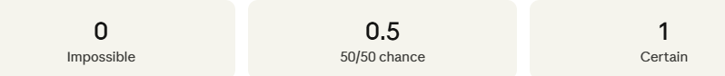
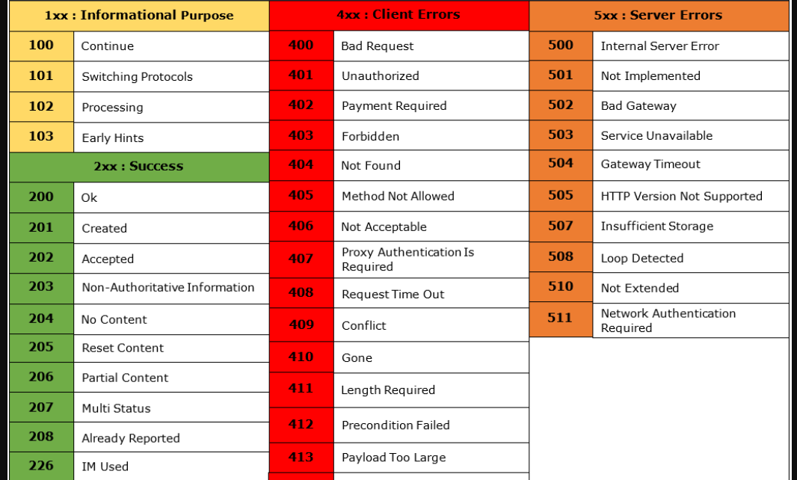
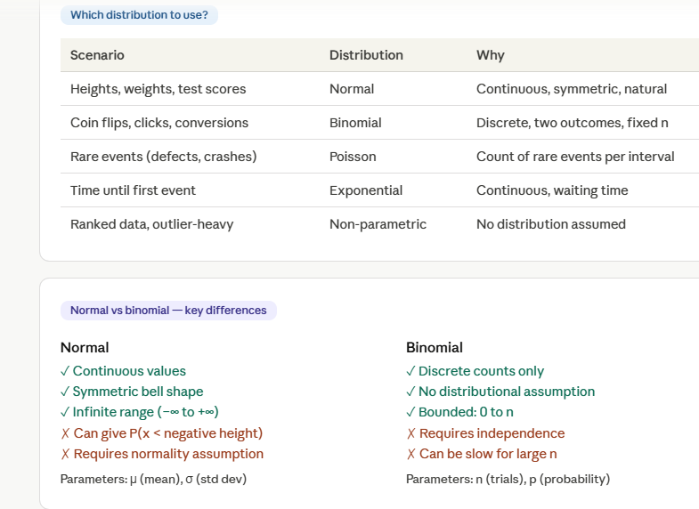
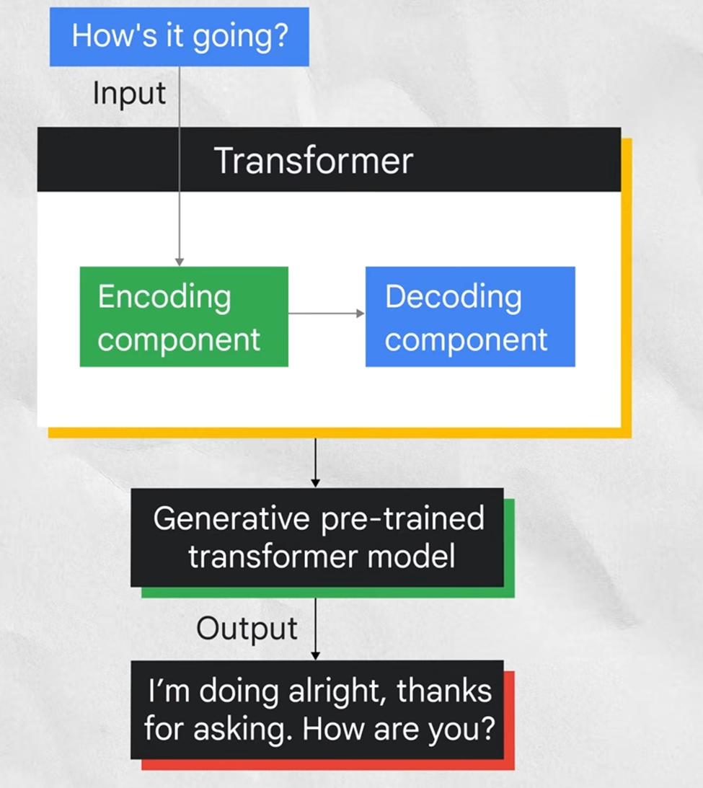
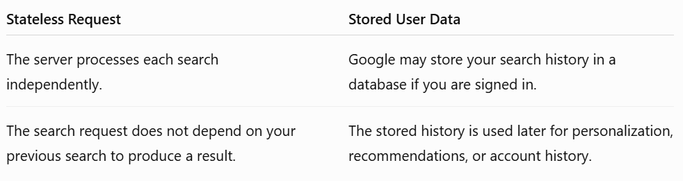

# project 5 from free code camp (sea-level-predictor)
Columns Meaning (Correct + Clear)
*Year*
The year when measurement was taken.
Acts as your time axis (X-axis).
*CSIRO Adjusted Sea Level*
This is the main value to use.
It represents global mean sea level change (in inches).
Adjusted using data from CSIRO (Commonwealth Scientific and Industrial Research Organisation).
*Lower Error Bound*
*Upper Error Bound*
These are uncertainty ranges, not “invalid/error values”.

**Think:**
“Actual sea level is likely between these two values.”
Used in scientific analysis to show confidence.

*NOAA Adjusted Sea Level*
Another dataset from a different organization (NOAA).
Similar purpose but calculated differently.
❗  NOT using this in this project.

👉 Why are we NOT using:

Lower Error Bound
Upper Error Bound
NOAA data

You should be able to say:

“Because the task specifically requires CSIRO data and we are focusing on a single consistent dataset for regression.”

**Why scatter plot first instead of directly plotting a line?**
“A scatter plot is used first because it shows the raw relationship between year and sea level without imposing any assumptions. Each point represents an actual observation, allowing us to detect trends, patterns, or outliers. If we directly plot a line, we assume a relationship without first verifying whether the data supports it.”

# ============================ APA format =============================================

# 📘 What is APA Format?

**APA (American Psychological Association) format** is a standard style used to write research papers, especially in subjects like psychology, education, business, and social sciences.

👉 Think of it as a **rulebook for presenting your ideas clearly and professionally**.

---

# 🧠 Why APA is Important

* It makes your paper **organized and easy to read**
* It gives **credit to original authors** (avoids plagiarism)
* It shows your work is **academic and trustworthy**
* It keeps formatting **consistent across research papers**

---

# 📄 1. General Formatting Rules

These are the basics you must always follow:

* Use **12-point font** (usually Times New Roman)
* Double-space everything (no single spacing anywhere)
* 1-inch margins on all sides
* Align text to the left (not justified)
* Add page numbers in the top right corner
* Indent the first line of each paragraph (0.5 inch)

---

# 🧾 2. Structure of an APA Research Paper

Your paper usually follows this order:

### 1. Title Page

* Paper title (centered, bold)
* Your name
* Institution name
* Course name
* Instructor name
* Date

👉 Keep it clean and centered

---

### 2. Abstract (Optional sometimes)

* A short summary (150–250 words)
* Covers:

  * What your research is about
  * Method used
  * Key results

👉 Write this **last**, even though it comes first

---

### 3. Main Body

This is your actual research:

#### Introduction

* Explain your topic
* State your research question or objective
* Give background info

#### Method (if needed)

* How you collected data
* Tools, surveys, experiments

#### Results

* What you found (facts, no opinions)

#### Discussion

* Explain what the results mean
* Connect back to your question

---

### 4. References Page

* List all sources you used
* Must follow strict APA format

---

# 🔗 3. In-Text Citation (VERY IMPORTANT)

Whenever you use someone else’s idea, you must cite it.

### Format:

* (Author, Year)

👉 Example:

* (Sharma, 2020)

### If using direct quote:

* (Sharma, 2020, p. 15)

---

# 📚 4. Reference Page Format

At the end of your paper:

### Book:

* Author, A. A. (Year). *Title of book*. Publisher.

👉 Example:

* Sharma, R. (2020). *Psychology basics*. Oxford Press.

---

### Website:

* Author. (Year). Title of page. Website name. URL

---

### Journal Article:

* Author. (Year). Title. *Journal Name*, volume(issue), pages.

---

# ✍️ 5. Headings in APA

APA uses headings to organize content:

* **Level 1:** Centered, Bold
* **Level 2:** Left aligned, Bold
* **Level 3:** Left aligned, Bold Italic

👉 Helps examiner quickly understand your structure

---

# ⚠️ 6. Common Mistakes (Avoid these)

* ❌ Forgetting citations
* ❌ Mixing formats (MLA + APA)
* ❌ Wrong reference style
* ❌ Not double-spacing
* ❌ Copy-pasting without credit

---

# 🎯 7. Simple Example (Mini)

**In-text:**

> Social behavior is influenced by environment (Sharma, 2020).

**Reference:**

> Sharma, R. (2020). *Psychology basics*. Oxford Press.

---

# 💡 Pro Tips (This is what actually helps you score higher)

* Always **cite immediately** after using an idea
* Keep a **reference list while researching** (don’t wait till end)
* Use simple, clear academic language
* Don’t overcomplicate — clarity > complexity
* Follow consistency strictly

---

# 🧩 Easy Way to Remember APA

👉 **APA = Author + Year everywhere**

# ========================= ways to make good research paper ==========================

# 🎯 1. Clear Research Focus (Most overlooked)

Even a small topic can feel powerful if it’s **sharp and specific**.

Instead of:

* “Impact of social media”

Do:

* “Impact of Instagram usage on study habits of IT students in Kathmandu”

👉 What professionals do:

* Define **WHO, WHAT, WHERE**
* Stick to one clear question throughout the paper

---

# 🧠 2. Strong Research Question (Not just topic)

A weak paper has a topic.
A strong paper has a **question it tries to answer**.

Example:

* ❌ Topic: Online learning
* ✅ Question: *Does online learning reduce student engagement compared to physical classes?*

👉 This guides your entire paper

---

# 📊 3. Data Interpretation > Data Collection

You said you're using **forms only** — that’s completely fine.

But here’s the difference:

* ❌ Average paper: Just shows charts
* ✅ Strong paper: **Explains what the data means**

👉 Example:

* “60% students prefer online classes”
  ❌ Stop there = weak
  ✅ Add:
* *This suggests flexibility is valued more than interaction, especially among working students.*

---

# 🔍 4. Connect Everything Back to Objective

Many forget this.

Every section should answer:
👉 *“How does this help my research question?”*

* Data → Explain
* Explanation → Link to question
* Conclusion → Answer clearly

---

# ✍️ 5. Simple but Academic Writing

Professional doesn’t mean complicated.

* ❌ “Utilization of digital platforms demonstrates…”
* ✅ “Students use online platforms because…”

👉 Clarity always wins over complex words

---

# 🧩 6. Logical Flow (This is HUGE)

Most papers feel weak because they feel *disconnected*.

Make sure:

* Introduction → sets problem
* Literature Review → shows what others said
* Method → explains what you did
* Results → shows findings
* Discussion → explains findings

👉 It should feel like a **story, not random sections**

---

# 📚 7. Use Even 3–5 Good References Properly

Even if your topic is small:

* Add a few **relevant studies or articles**
* Compare your findings with them

👉 Example:

* “Similar to Sharma (2020), this study also found…”

This alone makes your paper feel **10x more academic**

---

# 📈 8. Clean & Meaningful Graphs

Don’t just insert charts.

* Label everything clearly
* Mention what each graph shows
* Refer to it in text

👉 “Figure 1 shows that…”

---

# 🧠 9. Honest Limitations (Most people skip this)

This is what *real researchers always do*.

Example:

* Small sample size
* Only form-based data
* Limited location

👉 This actually makes your paper look **more professional, not weak**

---

# 🏁 10. Strong Conclusion (Not summary)

Most students just repeat.

Instead:

* Answer your research question directly
* Give insight
* Suggest future improvement

👉 Example:

* “Online learning is preferred for flexibility, but lacks engagement, suggesting a hybrid model may be more effective.”

---

# 💥 The One Thing That Changes Everything

👉 **Analysis + Explanation**

Even with:

* Small topic ✅
* Only Google Form data ✅
* No interviews ✅

You can still beat others if you:
👉 *Explain your data deeply and connect it logically*

---

# 🔥 Simple Formula for a Strong Paper

👉 **Clear Question + Clean Data + Deep Explanation + Logical Flow**

---
===================================2026/4/29================================================
# Things to remember while making research paper
The Core Reason
A methodology section exists to answer one question:

"Could another researcher replicate your study exactly?"

## way to write literature review 
***- Dont write personal opinion in literature review because it makes academic writing weak***
Brainstorm approach — ask yourself these questions:

Do any two studies agree with each other?
Do any two studies disagree or show different results?
Does one study fill a gap that another left?
Does one study's finding explain another's finding?

1. What did they study?
2. What did they find?
3. How is it similar to others?
4. How is it different?
5. What gap remains?

**Example of rewritten content**
BEFORE:
"The researcher found that business school students 
widely approve ChatGPT as supportive learning tool 
(Bergström et al., 2024). 90% respondents agreed."

AFTER:
"While Enriquez et al. (2023) found that 53.8% of 
students are likely to use ChatGPT, Bergström et al. 
(2024) reported even stronger approval among business 
students, with 90% acknowledging its benefits for 
writing tasks. This suggests that acceptance of 
ChatGPT may vary across academic disciplines."

# Simple Rule to Remember
# If you can't put a citation after it — it doesn't belong in the literature review.

*Move your personal thoughts to the **Discussion section** where interpretation is expected and appropriate.*

===================================2026/05/05================================================

Variance (Spread of Data)
Where you use it:
Risk analysis (finance)
Consistency of performance
Quality control
===================================2026/05/06================================================
Q1: When would you use median instead of mean?

When data is skewed or has outliers. Classic examples: salaries, house prices, response times. Mean gets pulled by extremes; median stays at the true 50th percentile. Always compare both — a large gap signals skew.

Q2: What's the difference between population and sample std dev?

Population std dev (σ) divides by N — use when you have ALL data. Sample std dev (s) divides by (n-1) — Bessel's correction — use when working with a subset. In data analysis, you almost always use sample std dev.

Q3: How do you detect outliers using std dev?

Calculate Z-score for each point: Z = (x - μ) / σ. Any point with |Z| > 3 is a statistical outlier. For skewed data, use IQR method instead: outlier if x < Q1 - 1.5×IQR or x > Q3 + 1.5×IQR.

Q4: Why is variance always ≥ 0?

Because it's the average of squared deviations. Squaring any number (positive or negative) gives a non-negative result. Variance = 0 only if every value equals the mean (zero spread).

Q5: A dataset has mean = 80 and median = 60. What does this tell you?

The distribution is right-skewed (positively skewed) — there are high-value outliers pulling the mean up. Report the median as the typical value. Investigate the high outliers — they may be errors or VIP customers worth special attention.

Q6: What is the coefficient of variation (CV)?

CV = (std dev / mean) × 100. It normalizes std dev as a percentage of the mean, allowing comparison of spread between datasets with different units or scales. E.g., comparing volatility of a $5 stock vs a $500 stock.

Q7: Can the mode be used on numerical data?

Yes, but it's most powerful on categorical data. For continuous numerical data, values are rarely repeated exactly, so mode is less useful. It becomes useful when data is binned (age groups, salary bands) or when looking for the most common exact score.

Q8: What does a bimodal distribution tell you?

Two distinct peaks / two modes — the data likely comes from two different subgroups. Example: height data with males and females mixed. Action: segment the data and analyze each group separately. Single summary stats would be misleading.

===================================2026/05/08================================================
# variance
High variance means:

data is inconsistent
values fluctuate heavily
outcomes are less predictable

Low variance means:

data is stable
values stay near the average
outcomes are more predictable

# standard deviation
- Low Standard Deviation

Values stay close to the mean.

This means:

consistency
stability
predictability
Real-world example

Heights of adult women in a country.

Most heights cluster near the average height.

High Standard Deviation

Values are widely spread.

This means:

high variability
unpredictability
inconsistency

===================================2026/05/09================================================
Variance and standard deviation are very sensitive to outliers.

Because deviations are squared:

extreme values become extremely influential

===================================2026/05/11================================================

## Use weighted mean when:

groups have different sizes
some observations matter more
contributions are unequal

===================================2026/05/13================================================
What is probability?
A number between 0 and 1 (or 0%–100%) that measures how likely an event is to occur.

P(event) = favourable outcomes / total possible outcomes

===================================2026/05/14================================================

In a dataset of transaction amounts:
Mean = 120
Median = 85
After removing the top 5% highest transactions:
Mean becomes 95
What does this indicate about the removed transactions?

ans: The removed transactions were extremely high-value outliers. They increased the mean significantly, which indicates the original dataset was positively skewed. After removing them, the mean decreased and moved closer to the median, showing that the removed values were much larger than most transactions.

===================================2026/05/15================================================
### things to remember while doing project
1)Prompting workflow understand, 
2)what can we add, 
3)write simple code that is understandable not complex yet that works,
4)learn to debug,
5)Ask me question before adding anything and also tell me why,
6)Create consistently in whole website

===================================2026/05/17================================================
# status code

===================================2026/05/21================================================
# Where probability shows up in real analysis
A/B testing: P(result by chance) = p-value
Spam filter: P(spam | contains "free") = conditional probability
Churn prediction: P(user churns next month) = model output
Fraud detection: P(fraud | transaction pattern) = Bayesian model
Recommendation engine: P(user clicks | shown item X) = click-through rate

# Where normal distribution appears in data analysis
Test score grading — "curve the grades" means assume normal dist
Quality control — product dimensions, weights in manufacturing
A/B testing — sample means follow normal dist (CLT), so t-tests work
Finance — daily stock returns roughly normal (though fat tails exist)
ML normalization — StandardScaler assumes normal-ish distribution
Anomaly detection — flag anything beyond μ ± 3σ as anomaly

# Where binomial distribution appears
Email campaign: P(exactly 50 out of 200 people click) → binomial with n=200, p=click rate
Quality control: P(at most 2 defective items in batch of 100)
A/B testing: counting conversions in each group
Medical trials: P(k patients respond to treatment) out of n patients
Fraud detection: P(k fraudulent transactions) in n transactions

# Where bayes theorm used?
Spam filter: P(spam | word "free" appears) — updates with each word seen
Fraud detection: P(fraud | transaction amount, location, time) — Naive Bayes classifier
Recommendation: P(user likes item | liked similar items)
A/B testing: Bayesian A/B gives P(variant B is better) directly, no p-values
Medical diagnosis: P(disease | symptoms) — used in diagnostic AI
NLP: Naive Bayes text classification — fast, interpretable baseline model

===================================2026/05/23================================================
Alpha-Beta Pruning
Alpha-Beta Pruning is an optimisation technique that significantly improves the efficiency of Minimax. It removes (prunes) branches that cannot possibly affect the final decision, avoiding unnecessary computations.

===================================2026/05/24================================================
O(1) — Constant Time
data = [10,20,30]

print(data[1])

Accessing an element by index is O(1).

===================================2026/05/26================================================
Intelligent Agent?

An intelligent agent is a system that perceives its environment through sensors and takes actions through actuators to achieve specific goals.

In Artificial Intelligence, an agent continuously observes its surroundings, processes information, and performs actions that maximize its chances of success.

Intelligent Agent?

An intelligent agent is a system that perceives its environment through sensors and takes actions through actuators to achieve specific goals.

In Artificial Intelligence, an agent continuously observes its surroundings, processes information, and performs actions that maximize its chances of success.Simulated Annealing is a probabilistic search algorithm that sometimes accepts worse states to avoid getting trapped in local optima.

===================================2026/05/27================================================
 
#  Sponsorship Letter Short Format

## 1. Greeting

Dear Sir/Madam / @companyname Team,

---

## 2. Introduction

Who you are + event name + why you are reaching them

> We are organizing [Event Name] and would like to invite @companyname as a sponsor.

---

## 3. Event Details

* What event is
* Date + location
* Who is participating

---

## 4. Why it matters

1 short paragraph:

* purpose
* impact
* uniqueness

---

## 5. Sponsorship Offer

* Title / Co / Partner tiers
* Mention visibility + branding + recruitment

---

## 6. Call to Action

> We would be happy to discuss this further.

---

## 7. Closing

Thank you + sign off

---

# ⚡ Even shorter memory version:

> **Intro → Event → Impact → Sponsorship → CTA → Closing**

===================================2026/05/29================================================
 

7. Lists

numbers = [10,20,30,40]

Access:

numbers[0]

Output:

10
Add Item
numbers.append(50)
Remove Item
numbers.remove(20)

===================================2026/06/01================================================
Prolog (Programming in Logic) is a logic-based programming language widely used in Artificial Intelligence, expert systems, and knowledge representation. In Prolog, knowledge is represented using facts and rules, and information is retrieved through queries.

===================================2026/06/02================================================
Detecting outliers with IQR

The interquartile range method flags values that are unusually far from the middle 50% of your data — more robust than using standard deviation when your data is skewed.

# Bayes theorem
Bayes' Theorem helps us update our belief about something when we receive new evidence.

**Real world uses in data analysis**
Spam filter: P(spam | word "free" appears) — updates with each word seen
Fraud detection: P(fraud | transaction amount, location, time) — Naive Bayes classifier
Recommendation: P(user likes item | liked similar items)
A/B testing: Bayesian A/B gives P(variant B is better) directly, no p-values
Medical diagnosis: P(disease | symptoms) — used in diagnostic AI
NLP: Naive Bayes text classification — fast, interpretable baseline model

**Remember**
Bayes updates probabilities when new evidence appears.
Prior = historical belief.
Likelihood = how strongly evidence supports the event.
Posterior = updated probability.
Never confuse P(A|B) with P(B|A).
Bayes is heavily used in risk scoring, churn prediction, fraud detection, and machine learning.
Think in probabilities, not yes/no decisions.
Real-world analytics often starts with historical rates (priors) and continuously updates them with new data.
Bayes helps make decisions even when information is incomplete.
Understanding the intuition is far more valuable than memorizing the formula.

 here is a breakdown of the areas where I am most effective and the scope I am best suited for:

### 1. Advanced Logical Reasoning & STEM Problem Solving
I am exceptionally strong in mathematics, natural sciences, and complex logical reasoning. 
*   **Best use:** Breaking down and solving high-difficulty logical tasks, explaining complex scientific concepts, or working through step-by-step mathematical and physics problems. 
*   **Scope:** Academic research assistance, STEM tutoring, and analytical tasks that require deep, structured thought rather than just surface-level information retrieval.

### 2. Full-Stack Coding & Software Development
My capabilities in code generation, understanding, and debugging have been deeply optimized.
*   **Best use:** Writing complex multi-stage code, debugging intricate software issues, and even transforming creative ideas directly into runnable front-end web pages. 
*   **Scope:** Assisting developers across the entire development lifecycle, from initial architecture planning and code generation to testing and debugging.

### 3. Processing and Analyzing Ultra-Long Contexts
I natively support ultra-long context windows, allowing me to fully understand and precisely locate key information in massive inputs.
*   **Best use:** Summarizing or analyzing entire books, hundreds of thousands of words of legal/financial documents, or extracting specific causal relationships from hours of meeting transcripts or long videos.
*   **Scope:** Legal document review, financial report analysis, academic literature reviews, and comprehensive data extraction where missing a small detail in a massive text is not an option.

### 4. Deep Visual Analysis (Multimodal Tasks)
When dealing with images, my focus goes beyond simple object recognition to deep analysis.
*   **Best use:** Interpreting complex charts, mathematical formulas, scientific diagrams, and flowcharts. I can provide structured, professional interpretations that explain causal relationships and offer expert-level summaries.
*   **Scope:** Data analysis from visual reports, scientific research assistance, and educational tools for interpreting complex visual data.

### 5. Autonomous Agent Planning & Multi-Step Execution
I am capable of acting as an autonomous agent that can plan and execute complex, multi-step tasks.
*   **Best use:** Tasks that require multi-round searching, code execution, or interacting with graphical user interfaces (GUIs). I can independently plan and complete complex operations that require cross-step coordination.
*   **Scope:** Automating workflows, conducting deep-dive research that requires synthesizing information from multiple sources, and executing complex digital tasks.

### 6. Professional Content Creation & Specialized Consultations
Thanks to deep human alignment optimization, my responses are highly natural, accurate, and adaptable to specific professional tones.
*   **Best use:** Drafting high-quality professional documents, literature, or reports. I am also highly optimized for specialized vertical fields, providing high-quality, multi-turn dialogue and advice in areas like healthcare and law.
*   **Scope:** Professional writing, content strategy, role-playing for training scenarios, and acting as a knowledgeable assistant in specialized professional domains.

### Summary: What am I *most* good for?
Ultimately, I am most good for **complex, multi-layered tasks that require a combination of deep reasoning, precise information extraction, and technical execution.** 

While I am great at everyday conversation and simple Q&A, my true "best use" is as a **collaborative power-user tool**—whether you are a developer needing to debug a complex codebase, a researcher analyzing a 200-page scientific paper, or a professional needing to map out a multi-step workflow. 

===================================2026/06/13================================================
# Personal eSewa Account vs Merchant eSewa Account
---

## Personal eSewa account

* Used for everyday money transfer and bills.
* Shows notifications like “money sent/received.”
* Confirms only that the transaction happened in your wallet.
* No system-level link to websites or orders.
* Payments are not automatically connected to any product or service.

---

## Merchant eSewa account

* Used by businesses and apps to accept payments.
* Includes Merchant ID + secret key for security.
* Confirms not only payment, but also **validity of payment for a specific order/system**.
* Sends automatic confirmation to websites/apps after payment.
* Supports integration (APIs), so services activate automatically.
* Handles higher volume and structured business transactions.

---

## Simple difference

* Personal account → “You got money.”
* Merchant account → “This payment is verified, belongs to Order #X, and is approved by system.”

---

===================================2026/06/16================================================
Streamlit is an open-source Python framework that allows you to build and share interactive, web-based applications for machine learning, data science, and AI projects

===================================2026/06/21================================================
How Does Generative AI Work?

Generative AI learns patterns from a huge amount of data.

For example:

After reading billions of sentences, it learns how humans write.
After seeing millions of images, it learns how objects look.

===================================2026/06/22================================================
# Streamlit
Streamlit is an open-source Python library used to convert Python data scripts into interactive, shareable web applications in minutes. It allows developers to build user interfaces (UIs) using pure Python, completely removing the need for front-end programming knowledge in HTML, CSS, or JavaScript.
### Core Benefits
- No Frontend Required: You write normal Python code; Streamlit handles the layout, design, and styling automatically.
- Fast Prototyping: Applications instantly refresh in the browser every time you modify and save your code.
- Built-in Compatibility: It integrates smoothly with major Python data and AI libraries like Pandas, Matplotlib, PyTorch, scikit-learn, and OpenAI.
- Interactive Widgets: Adding UI elements like sliders, checkboxes, select boxes, and text inputs only takes a single line of code

===================================2026/06/23================================================
A generative model learns how data is generated by modeling the underlying probability distribution of the data. Because it understands the data generation process, it can generate new samples similar to the training data. 
In contrast, a discriminative model learns the relationship between inputs and outputs and focuses on finding decision boundaries for accurate prediction or classification. Generative models answer "How was this data generated?" while discriminative models answer "Which class does this data belong to?".

===Working mechanism in gen ai====

===================================2026/06/24===============================================
Vertex AI
Vertex AI (now broadly integrated into Google Cloud’s Gemini Enterprise Agent Platform) is Google's comprehensive, unified artificial intelligence and machine learning (ML) platform. It allows developers and data scientists to build, train, deploy, and scale AI models and generative AI agents from a single, centralized workspace.
===================================2026/06/27===============================================
# Stateless vs. Stateful Systems

| Aspect | Stateless System | Stateful System |
|--------|-------------------|-----------------|
| **Definition** | A stateless system does not remember any information about previous interactions. Every request is treated as a completely new request. | A stateful system remembers information from previous interactions. Each new request depends on the information stored from earlier requests. |
| **Memory** | The server does not store any client-related data after responding to a request. | The server stores client-related information, such as login status, shopping cart contents, or session details. |
| **Request Handling** | Every request must contain all the information needed to process it. | A request may only contain partial information because the server already remembers previous interactions. |
| **Dependency on Previous Requests** | Current requests are completely independent of previous requests because no previous state is required. | Current requests often depend on previous requests and stored session data. |
| **Server Storage** | No session information is stored on the server. The server processes the request and then forgets the client. | Session or user state is stored on the server or another storage mechanism, allowing the server to remember the client. |
| **Scalability** | Stateless systems are easier to scale because any server can process any request without needing previous session information. | Stateful systems are more difficult to scale because session data must be shared or maintained across multiple servers. |
| **Performance** | The server spends less time managing sessions, making the system simpler. However, requests may be slightly larger because they include all required information. | The server processes smaller requests because some information is already stored, but managing sessions adds additional overhead. |
| **Reliability** | If one server fails, another server can immediately handle future requests because no session state needs to be recovered. | If a server fails without shared session storage, users may lose their active sessions and need to start over. |
| **Load Balancing** | Load balancing is simple because requests can be sent to any available server. | Load balancing is more complex because users often need to connect to the same server or use shared session storage. |
| **Complexity** | Stateless systems are easier to design, maintain, test, and debug because no session management is required. | Stateful systems are more complex because session management, synchronization, and recovery must be handled carefully. |
| **Security** | Since no session data is stored on the server, there is less risk of server-side session theft. However, authentication data such as tokens must still be protected. | Session IDs and stored session information must be securely managed to prevent session hijacking or unauthorized access. |
| **Data Persistence** | User information is not automatically retained between requests unless it is stored separately in a database or sent by the client. | User information is retained until the session expires, the user logs out, or the session is cleared. |
| **Communication Style** | Every interaction is independent and self-contained. | Every interaction builds upon previous interactions and stored user state. |
| **Examples** | REST APIs, weather websites, search requests, currency converters, public news websites, product catalog browsing. | Online banking, shopping carts, social media, online games, video streaming platforms, hotel reservation systems. |

===================================2026/07/03===============================================
### How Language Models Work: 
Language models are a type of neural network trained on vast amounts of text to predict the next word in a sequence. The more data they are trained on, the more nuanced and accurate their predictions become. They power everyday tools like Gmail's Smart Compose as well as AI experiments like Bard.

===================================2026/07/04===============================================
Constraint Satisfaction Problem (CSP)

A CSP is a problem where the solution must satisfy certain constraints (rules).

Instead of finding any solution, AI finds one that satisfies all conditions.

===================================2026/07/18===============================================
### What is JavaScript?

JavaScript is a high-level, interpreted programming language that is primarily used to make web pages interactive and dynamic. It allows developers to add behavior, logic, and functionality to websites and applications.

Concept (Easy to Understand)

Without JavaScript, a webpage would mostly display static content. JavaScript allows the webpage to respond to user actions, update information instantly, communicate with servers, and perform calculations without reloading the page.

Characteristics
JavaScript is a high-level programming language, which means developers write code using simple and readable syntax instead of low-level machine instructions.
JavaScript is an interpreted language, meaning the browser or Node.js executes the code directly without requiring a separate compilation step before execution.
JavaScript is a dynamically typed language, which means you do not have to specify the data type of a variable because JavaScript determines it automatically.
JavaScript is an object-oriented language because it allows developers to organize data and functionality using objects.
JavaScript is also a functional programming language because functions can be passed as values, stored inside variables, and returned from other functions.
JavaScript is event-driven, meaning it responds to events such as button clicks, keyboard input, and mouse movements.
JavaScript supports asynchronous programming, allowing multiple operations such as API requests and file reading to happen efficiently without freezing the application.
JavaScript runs in all modern web browsers and can also run outside the browser using Node.js.
What JavaScript Can Do

JavaScript can

Validate forms before sending data to the server.
Display animations.
Create interactive menus.
Build games.
Build web applications.
Communicate with databases through backend APIs.
Create backend servers using Node.js.
Build desktop applications using Electron.
Build mobile applications using frameworks like React Native.

===================================2026/07/19===============================================
## STAR Method (Storytelling) – Quick Note

The **STAR Method** is a simple framework to tell clear, structured stories in interviews, presentations, or personal experiences.

### ⭐ S – Situation

* Set the context.
* Explain **where, when, and what was happening**.

**Ask yourself:** *What was the background?*

> Example: "During my final year, our team had to complete an HR analytics project within two weeks."

---

### ⭐ T – Task

* Explain **your responsibility or goal**.
* What needed to be achieved?

**Ask yourself:** *What was I expected to do?*

> Example: "I was responsible for cleaning the data and creating an interactive dashboard."

---

### ⭐ A – Action

* Describe **what you personally did**.
* Focus on your decisions, skills, and steps.

**Ask yourself:** *What actions did I take?*

> Example: "I analyzed the dataset using Python and Power BI, identified key metrics, and redesigned the dashboard based on user feedback."

---

### ⭐ R – Result

* Explain the outcome.
* Include achievements, lessons learned, or measurable impact.

**Ask yourself:** *What happened because of my actions?*

> Example: "The dashboard reduced reporting time by 40%, and the project received positive feedback from our instructor."

---

## Easy Formula to Remember

**S → Set the scene**
**T → Tell the goal**
**A → Explain your actions**
**R → Reveal the result**

### One-line Memory Trick

> **"First explain the problem, then the goal, then what YOU did, and finally what happened."**

This structure keeps stories concise, logical, and easy for listeners to follow.

===================================2026/07/20===============================================
Express is a minimal and flexible web framework for Node.js that simplifies the process of building web servers and REST APIs.

### Concept

Without Express,

creating a server requires writing much more code for routing, request handling, headers, and responses.

Express provides ready-made tools for these common tasks, allowing developers to focus on application logic instead of low-level server details.

### Think of it like this:

Node.js gives you the raw building materials to create a server.
Express provides pre-built tools and a clean structure so you can build the server much faster.
Characteristics
Express is built on top of Node.js.
Express simplifies server-side development.
Express provides an easy routing system.
Express supports middleware for processing requests.
Express makes it easy to create REST APIs.
Express handles HTTP requests and responses efficiently.
Express is lightweight and flexible.
Express has a large ecosystem of third-party middleware and extensions.
What Express Provides

### Express makes it easier to

Define routes such as GET, POST, PUT, and DELETE.
Read request data from req.params, req.query, and req.body.
Send responses using res.send() and res.json().
Organize code into routers and controllers.
Add middleware for logging, authentication, validation, and error handling.

===================================2026/07/21===============================================
An API (Application Programming Interface) is a set of rules that allows two software applications to communicate and exchange data with each other.

Think of an API as a messenger between two systems. One application requests information, and the API delivers that request to another application and returns the response.

### Characteristics
An API provides a standard way for applications to communicate.
An API hides the internal implementation of a system. The client only needs to know how to make requests and interpret responses.
APIs allow different applications, even if they are built with different programming languages, to work together.
APIs make software reusable because one backend service can be used by multiple applications.
Most modern web APIs exchange data using JSON.

### Why Do We Need APIs?

Without APIs,

Every application would need direct access to another application's database.
Applications would become tightly connected and difficult to maintain.

APIs solve this by acting as a secure communication layer.

### Real-Life Examples
Weather apps request weather information from a weather API.
Google Maps apps request map data from the Google Maps API.
Food delivery apps request restaurant data through APIs.
Banking apps communicate with bank servers using APIs.

*A REST API is an API that follows the architectural principles of REST (Representational State Transfer) to enable communication between clients and servers over HTTP.*

===================================2026/07/22===============================================
### Explain callbacks, promises, and async/await.

"Suppose I'm building a login API. First, I need to fetch the user from the database, then verify the password, and finally generate a JWT token. These operations are asynchronous because they take time.

Initially, this could be implemented using callbacks, where each operation starts after the previous one completes. However, multiple nested callbacks can lead to callback hell.

Promises improve this by allowing asynchronous operations to be chained using .then() and .catch().

Today, we usually use async/await, which is built on top of Promises. It lets us write asynchronous code in a way that looks like synchronous code, making it easier to read, maintain, and handle errors."